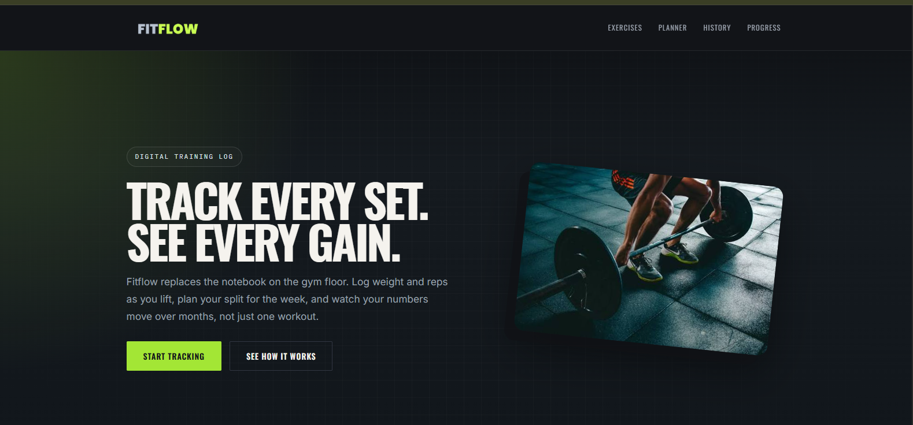
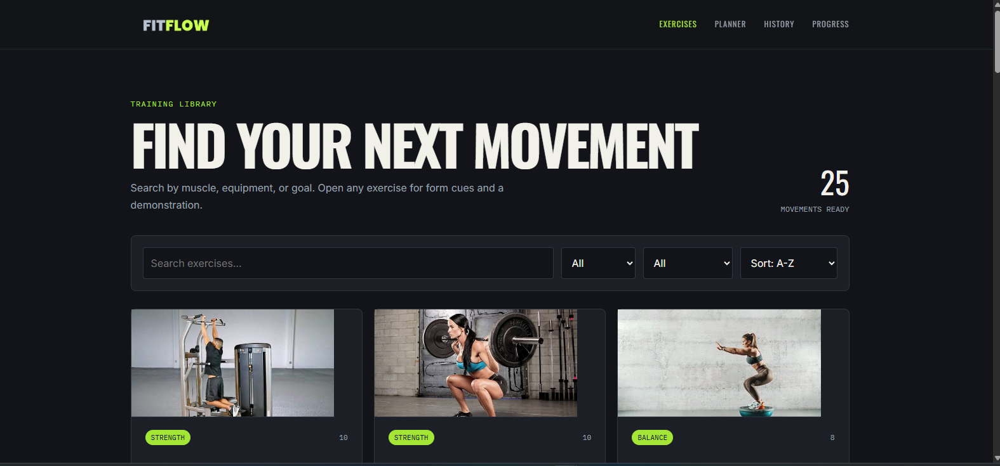
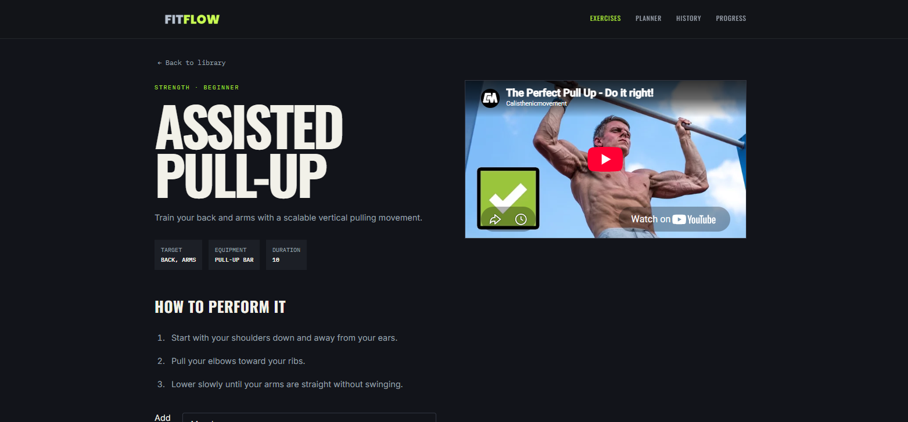
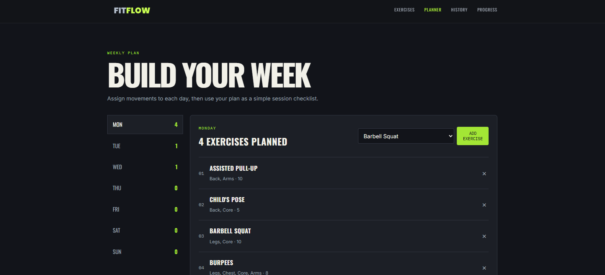
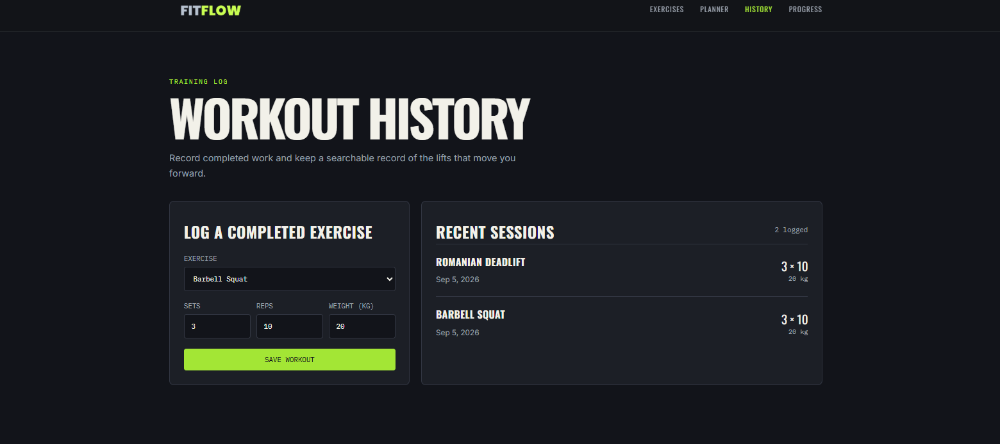
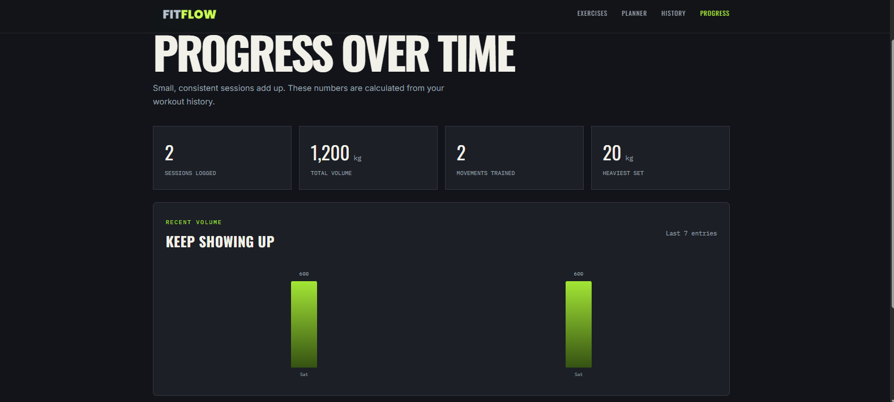
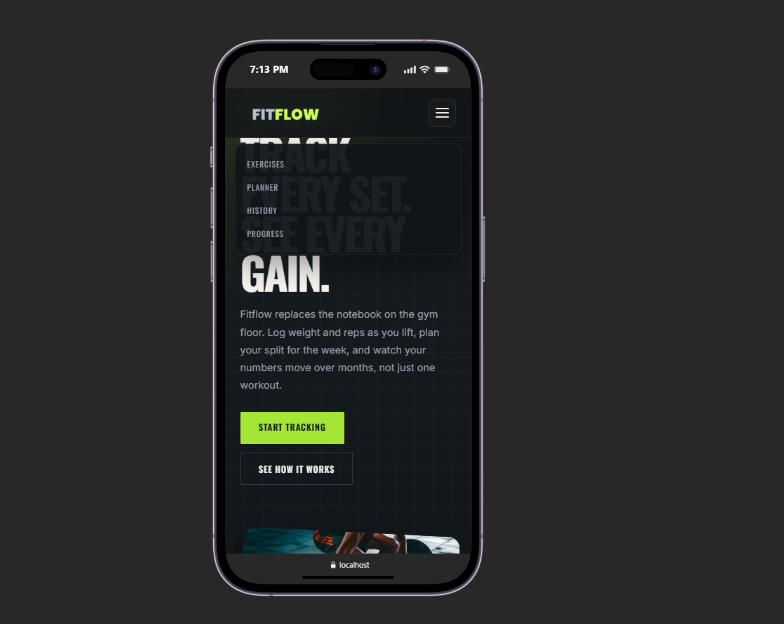
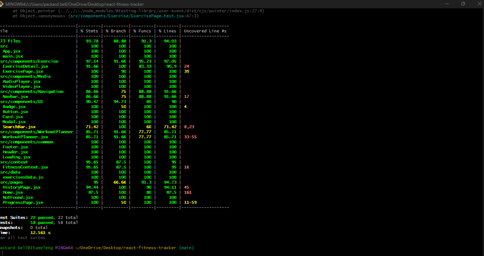

# FitFlow Fitness Tracker

FitFlow is a React fitness tracker for browsing exercises, building a weekly plan, recording completed workouts, and reviewing training progress. Exercise demonstrations are linked from the exercise detail pages, and workout data is saved in the browser so it remains available between sessions.

## Features

- Search the exercise library by name, muscle group, or equipment.
- Filter exercises by category and difficulty.
- Sort exercises alphabetically or by difficulty.
- View exercise instructions, metadata, images, and demonstration videos.
- Play native video and audio demonstrations with browser fallback text.
- Add exercises to a Monday-Sunday workout planner.
- Remove planned exercises or switch between planner days.
- Log completed exercises with sets, reps, and weight.
- Review recent workout history.
- View progress metrics including sessions, total volume, movements trained, and heaviest weight.
- Use responsive navigation on desktop and mobile layouts.

## Tech Stack

- React 19
- React Router 7
- PropTypes
- Vite
- CSS Modules and plain CSS
- Jest and React Testing Library

## Getting Started

### Requirements

- Node.js 18 or newer
- npm

### Install dependencies

```bash
npm install
```

### Start the development server

```bash
npm run dev
```

Vite will print the local URL, normally `http://localhost:5173`.

## Available Scripts

| Command           | Purpose                               |
| ----------------- | ------------------------------------- |
| `npm run dev`     | Start the Vite development server.    |
| `npm run build`   | Create a production build in `dist/`. |
| `npm run preview` | Serve the production build locally.   |
| `npm test`        | Run the Jest test suite.              |
| `npm run lint`    | Run ESLint across the project.        |

Useful test commands:

```bash
npm test -- --coverage
```

## Application Routes

| Route                    | Description                                           |
| ------------------------ | ----------------------------------------------------- |
| `/`                      | Home page with feature overview and calls to action.  |
| `/exercises`             | Searchable and filterable exercise library.           |
| `/exercises/:exerciseId` | Detail page for one exercise.                         |
| `/planner`               | Weekly workout planner.                               |
| `/planner/:day`          | Planner opened on a specific weekday.                 |
| `/history`               | Workout logging form and recent sessions.             |
| `/progress`              | Calculated workout progress metrics and volume chart. |

Unknown routes display the not-found page.

## Data and State

Exercise definitions are stored in [`src/data/exercisesData.js`](src/data/exercisesData.js). The shared fitness state is managed by [`src/context/FitnessContext.jsx`](src/context/FitnessContext.jsx), which exposes methods for:

- Adding and removing exercises from planner days.
- Logging completed workouts.
- Reading planner and history data.

The provider persists data in `localStorage` under the key `fitflow_fitness_data`. Clear that key in the browser's developer tools to reset local planner and history data.

## Project Structure

```text
src/
	components/       Reusable UI, navigation, exercise, and planner components
	context/          Shared fitness state and persistence
	data/             Exercise and weekday data
	pages/             Home, history, progress, and not-found pages
	App.jsx           Application routes and shared layout
	main.jsx          React entry point and BrowserRouter setup
	index.css         Global styles and design tokens
```

Tests are colocated with the source files they cover. They use Jest, `@testing-library/react`, `@testing-library/user-event`, and `@testing-library/jest-dom`.

## Coverage Report

The latest `npm test -- --runInBand --coverage` run reports:

| Metric     | Result |
| ---------- | -----: |
| Statements | 93.78% |
| Branches   | 88.88% |
| Functions  | 91.30% |
| Lines      | 94.03% |

Test suites: 22 passing
Tests: 58 passing

## Planning and Screenshots

The component hierarchy, data flow, props, state strategy, and testing strategy are documented in [View the Planning Document](Planning%20Document.pdf).

Add the required application screenshots to [`screenshots/`](screenshots/) before submission:


- Home page

- Exercises page with filters

- Exercise detail page with video

- Workout planner page

- Workout history page

- Progress page

- Mobile responsive view

- Jest coverage report


## Future Enhancements

- Add local media files and offline playback for demonstrations.
- Add richer progress charts and workout streak calculations.
- Add muscle-group filters and clear-all planner actions.
- Add user accounts and cloud synchronization.

## Production Build

Build and preview the application locally with:

```bash
npm run build
npm run preview
```
